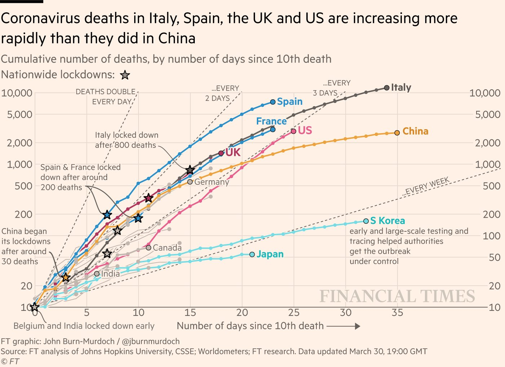

# Tues Sept 29: Doubling time

Today we will make a graph of the current COVID-19 data for Ontario. When only a small fraction of the population is resistant to an infection, the number of daily cases, in absence of any interventions such as physical distancing, is expected to grow exponentially over time.

Plotting data that shows exponential growth on regular axes can produce a graph that is difficult to read since the numbers when the population size are small will be unreadable due to the very large numbers that occur at later times. Our aim today is to produce a graph similar to Figure \@ref(fig:doublingtime2), but for the current Ontario COVID-19 data.

```{r doublingtime2, echo=FALSE, fig.cap="An example of a very well thought out data visualation where the data might demonstrate exponential growth", out.width="95%", purl=FALSE}

```

Visit the website: https://wzmli.github.io/COVID19-Canada/, this site is the _front end_ for the data we will use which are archived [here](https://github.com/wzmli/COVID19-Canada) (also referred to as the _back end_). These data can easily be pulled into `R` using this command:

```{r,eval=FALSE}
COVID.data <- data.table::fread('https://raw.githubusercontent.com/wzmli/COVID19-Canada/master/COVID19_Canada.csv', fill = TRUE)
```

To view the data type:

```{r,eval=FALSE}
head(COVID.data)
```

`head()` is a command that shows the first 6 lines of the quantity inside the round brackets. `COVID.data` is a very large table of data. If I type `COVID.data` into the Console I will get more information than I want, so I instead use `head()`.

Now, the data table `COVID.data` contains data for all provinces and I would like to _subset_ the data so that only the information pertaining to Ontario is left. 

```{r,eval=FALSE}
data.ON <- COVID.data[Province == "ON"]
```
