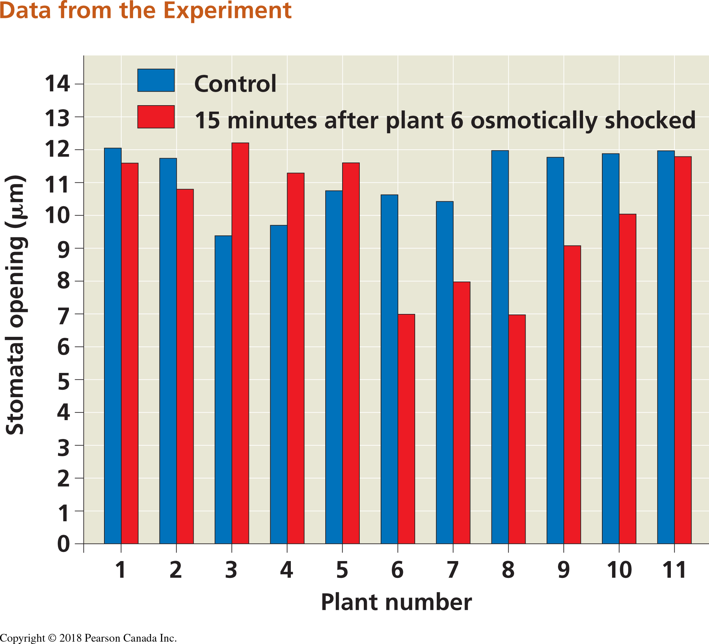

# BIOL 1001: QUANTIATIVE SKILLS LABORATORY PART 2 {#lab2}

This lab is worth 5% of your final mark. Before completing this lab, you should re-familiarize yourself with Chapters \@ref(intro), \@ref(graph),\@ref(data) and \@ref(hypothesis). If you need to consult the help files, use Chapter \@ref(help) to help guide you through the ```R``` help.

## BIOLOGICAL DATA WITH COMPUTERS {-}

---

PURPOSE

1. To learn how to record data in electronic format
1. To learn how to write hypotheses as equations
1. To learn how to choose the appropriate visualizations
1. To learn how to make graphs using R Studio

---


Before coming to the laboratory:

1. Install `R` and `RStudio`. For instructions see Chapter \@ref(install).
 
1. Before coming to the laboratory read:
 
In the quant guide: 

- Chapter \@ref(intro) 
- Chapter \@ref(graph)
- Chapter \@ref(data)
- Chapter \@ref(hypothesis)


## EXERCISE 1. Data entry and graphing with a continuous independent variable {-}

The increase of carbon dioxide in the atmosphere is expected to reduce the concentrations of carbonate ions in the surface of the ocean. This process, in general called ocean acidification, affects the biology and survival of a wide range of marine species because it prevents the formation of shells and plates of calcium carbonate.
A long term study on coral reefs showed how the net community calcification rate (G, measured in mmol CaCO~3~m^-2^d^-1^) is related to the concentration of carbonate (CO~3~^2-^, measured in  $\mu$mol$\cdot$kg^-1^) [@langdon2000effect]. 
We will use the data from the research paper (which is summarized in pg. 60 of the textbook) to understand this relationship.
The results of this experiment are as follows:

```{r langdon-data, echo = FALSE, results = 'asis'}
library(knitr)
dataset <- read.csv("LangdonDataset.csv")
kable(dataset[1:11,1:2], caption = "Raw data from Langdon and collaborators (2000).")
```
### Enter the data {-}

1. We provide this data as a .csv called `LangdonDataset.csv`. Download this file from Brightspace into the folder where your R files are. **NOTE** that in the `read.csv` command that what is inside the quote marks ```"``` MUST match the file name in your folder exactly. You also have to include the quotation marks. Then follow the instructions in Chapter \@ref(data-entry) and import the data. Note that this is just a subset of the data from the full paper. Include a copy of the code you used in your lab report.


### Make a graph {-}

1. Follow the instructions in Chapter \@ref(graph) to make a scatterplot for these data and replicate the figure from the Campbell textbook (see Figure 10.1 below). Include both the code you wrote and the final figure in your lab report. NOTE: Don't worry about figuring out how to write superscripts and subscripts in R for the axis-labels. You can use the "^" symbol to indicate a superscript, and the "-" to indicate a subscript. 

**HINT** Think about what you are specifying as ```x``` and ```y``` in the ```plot``` function. Use the tools you learned about in Chapter \@ref(rintro) to explore the dataframe.

**NEW TIP** instead of entering the data as a vector the way you learned in Chapter \@ref(graph), you can use the code below to create an x vector from a data frame (here I titled my data frame "langdon_data"; your name may be different, and I created a vector of data called "CO3"). The ```$``` sign tells R to look in the data frame specified before the ```$``` sign (in the example below the data frame is "langdon_data" and then read the column that comes after the ```$``` sign (in the example here, it's CO3. The column header you specify after the $ sign MUST match the way it is shown in the dataframe EXACTLY. Use the commands you learned in Chapter \@ref(rintro) to confirm what the column header is. 

You can use this to create the vector of data that you need to plot on the x-axis, and then write you own code to create the vector of data for the y-axis. 

```{r langdon, fig.cap="Scatterplot from Langdon et al. study on calcification rate in seawater as a function of carbonate concentration. This figure is found in your textbook on pg. 60", fig.align='center', out.width="70%", fig.show='hold', echo=FALSE}
knitr::include_graphics('./figures/Landgon_scatterplot.jpeg')
```

```{r}
langdon_data <- read.csv("LangdonDataset.csv")
CO3 <- langdon_data$CO3
```

Use the examples in Chapter \@ref(graph) to create a fully labelled scatter plot. Export this and paste it into your document that you will hand in for this lab. Include both the code you wrote and the final figure in your lab report.

**HINT** if you want to add a line of best fit based on linear regression, use the function ```abline``` using a linear regression model (the function ```lm```). Your code will look something like this: ```abline(lm(y~x))```  Refer to the help files for assistance. The two terms on each side of the tilde ("~" symbol) tell R what the equation for the regression ```y~x``` is. In your case substitute in what YOU defined as ```x``` and ```y``` in R.  **NOTE** for the lab assignment, this step is optional. 


1. Follow the instructions in Chapter \@ref(graph) to make a second graph - a line graph for these data. Export your line graph insert it into your lab report. Write a figure caption. Include both the code you wrote and the final figure in your lab report.


 
## EXERCISE 2.	Barplots and boxplots with discrete independent variables {-}

We will use data from a research paper that investigated 
whether plants were able to respond to stress cues emitted from their drought-stressed neighbours
[@falik2011rumor]. This research project is also discussed in your textbook. 
The research team used _Pisum sativum_ plants in an experimental setup that allowed them to connect the plants' root systems. One plant in the central position of a row was subjected to osmotic stress, while neighbouring plants remained unstressed on both sides. 
Plants on one side of the stressed plant shared roots with others in the group but
did not share roots with the stressed plant; 
these were the control group. 
On the other side, the stressed plant shared its roots with its nearest unstressed neighbour, and all the other plants shared their roots with their nearest neighbour
(See Figure \@ref(fig:setup)).

```{r setup, fig.cap="Experimental set up for testing stress cues. Circles represent plants and connector lines represent the plants with connected roots. The numbers of the plants correspond to those of Table 10.2. Osmotic stress was induced in plant 6 (Modified from Falik et al., 2011).", fig.align='center', out.width="70%", fig.show='hold', echo=FALSE}
knitr::include_graphics('./figures/Falik_et-al_2011_setup.jpg')
```


Stress was quantified fifteen minutes after the induction of drought by measuring the width of the stomatal openings on the leaves of the plants. The results of this experiment are as follows:

```{r raw-data, echo = FALSE, results = 'asis'}
library(knitr)
falik_data <- read.csv("FalikDataset.csv")
kable(falik_data[1:3], caption = "Raw data from Falik and collaborators (2011).")
```

### Questions {-}
1. Follow the instructions in Chapter \@ref(data-entry) to load the data file FalikDataset.csv using the command line (```read.csv```) option. **Note** that the data in the CSV file are ordered differently than in the list above (to verify this you can open the CSV file in Excel to see the full set).


1. Looking at the dataset, can you tell how many treatments were applied in the experiment? How many plants were used for each treatment?

1. What is the smallest stomatal width measured? What is the largest?

## EXERCISE 2b.	Making a barplot {-}
### Questions {-}

1. Follow the instructions below to replicate the figure from the Campbell textbook (bar plot; see Figure 10.3 below). Export your bar graph insert it into your lab report. Add a caption to your bar plot and hand it in with your lab report. Include the code you wrote to generate the figure.

```{r falik, fig.cap="Barplot from Falik et al. study on plant stress and plant communication. This figure is found in your textbook on pg. 910", fig.align='center', out.width="70%", fig.show='hold', echo=FALSE}

```


To make a barplot, use the code below as a starting point, and then use the resources in this guide to add appropriate x and y axis labels.Don't worry about figuring out how to write the symbol "mu" in R; you can just write "um" or "micrometres" for now. However, if you want to try writing Greek symbols in R, look at the code below for the boxplot example, and see if you can apply it to your barplot.

```{r}
width <- falik_data$width #This creates a vector of data of the plant stomatal widths
plant <- falik_data$plant #The creates a vector of data of the plant ID numbers


barplot(width, names = plant, col = c("blue", "red"))
```

1. In the barplot, what can you tell about the stomatal openings of the treatment plant vs. the control plants? Is it consistent across all the individual plants?

1. Follow the instructions below to re-plot the data from EXERCISE 2b as a boxplot that compares control versus treatment. Export your boxplot and insert it into your lab report. Add a caption to your boxplot. NOTE: If you describe what the symbols/colours mean in the caption, then you do not need to include a legend. If you want to try adding a legend (adding one is optional) then look up "legend" in the help window.

````{r}
control <- subset(falik_data, type == "control") #This subset command is a handy function to break the data into subsets. Here, we're creating a data frame with just the values from the control.
treatment <- subset(falik_data, type == "15min") #Here we are subsetting the data to contain only the data from the treatment

boxplot(control$width, treatment$width, names = c("control", "treatment"), ylab = expression(paste("stomatal opening ( ", mu, ")")))

```

1.	Label the following on the boxplot: median, 25% and 75% quantiles, 95% confidence limits. **HINT** you can insert the exported graph into a blank PowerPoint slide and use lines/text boxes to draw the labels. Then save the slide as an image file (e.g., JPEG) and insert it in your lab report.

1.	What does the boxplot tell you about the differences between the treatment plants (plants 6-11) vs. the control plants that the bar chart does not?

1.	Why do you think a scientist might choose to represent these data one way over another?


